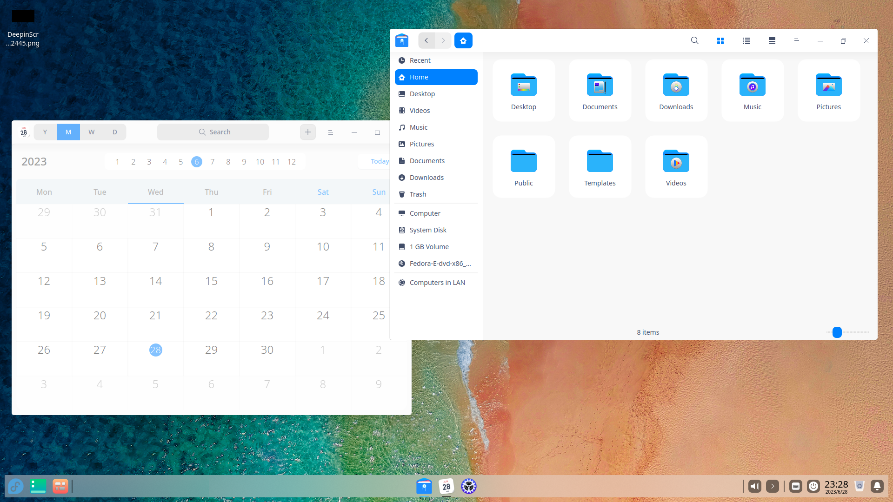

# deepin

**This image is experimental**

To try this image, you can use an existing Fedora Silverblue install.

## Rebase over Fedora Silverblue

    rpm-ostree rebase ostree-image-signed:docker://ghcr.io/ublue-os/deepin-main:latest

or if you have an NVIDIA GPU:

    rpm-ostree rebase ostree-image-signed:docker://ghcr.io/ublue-os/deepin-nvidia:latest
